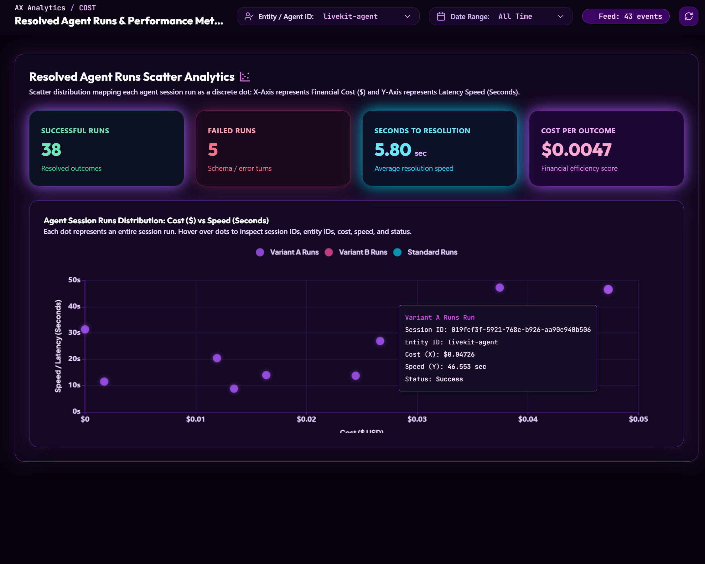
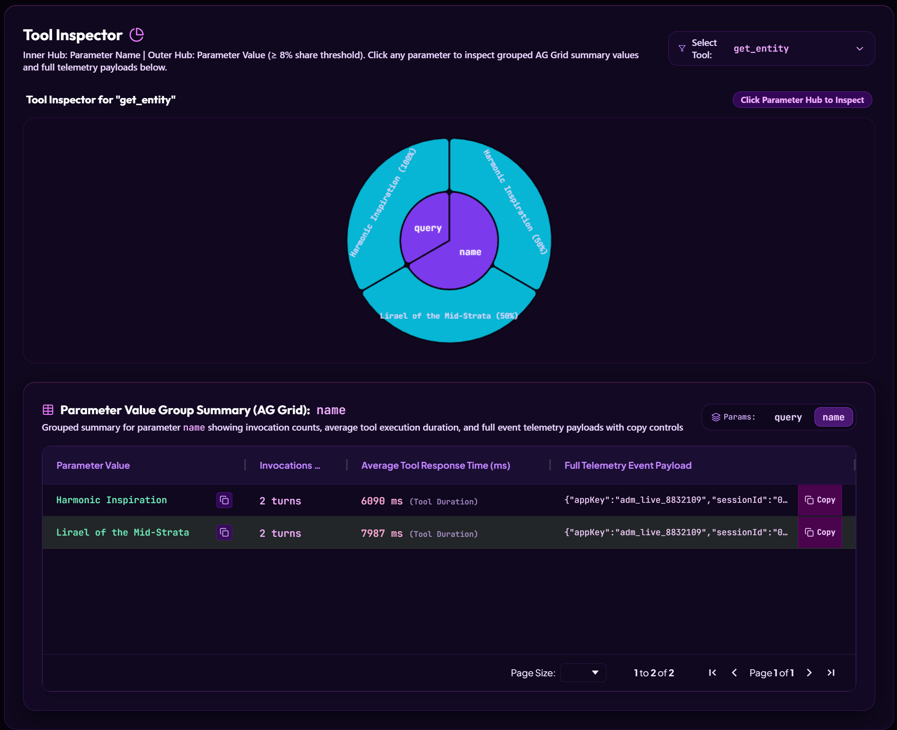
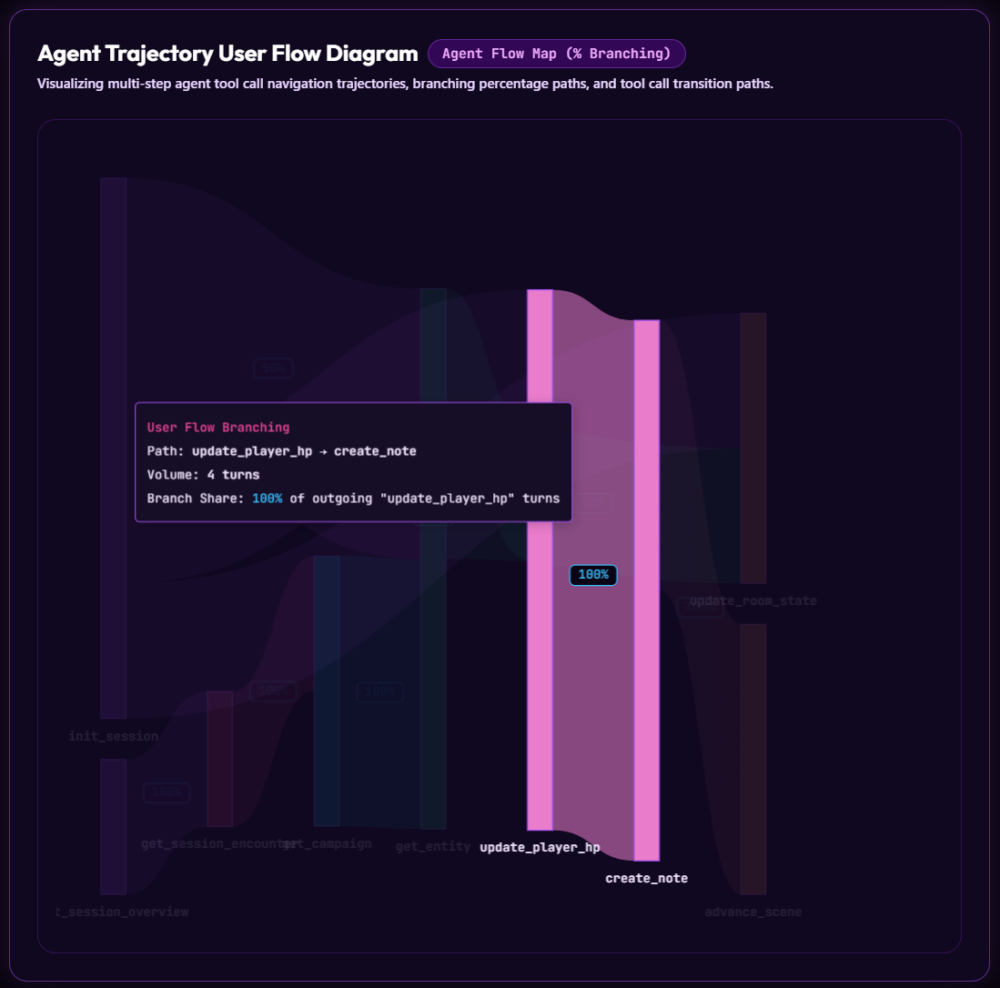
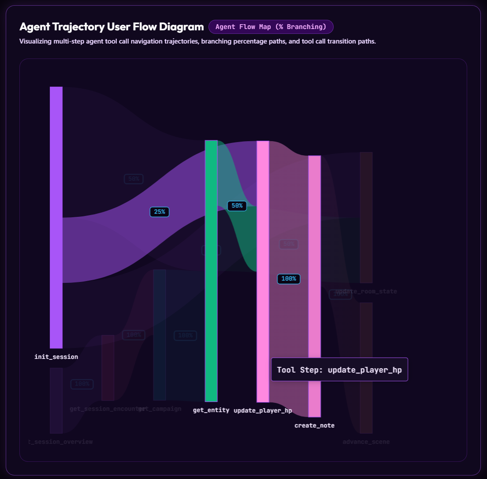

# AX Analytics — Agent Experience Analytics Platform

> **Open-source, self-hosted telemetry platform for AI agent developers.** Ingest tool call traces, observe agent session trajectories, run sticky A/B experiments, and inspect parameter-level performance data — all in a Cyberpunk Neon Purple dashboard.

---

## What Is This?

**AX Analytics** is a monorepo analytics backend + admin dashboard purpose-built for **agentic AI applications**. If you're building LLM-powered agents that invoke tools, make decisions, and run multi-step sessions, this platform gives you full visibility into what they're doing, how fast, and at what cost.

<p align="center">
  <a href="files/resolved-agent-runs.png">
    
  </a>
  <a href="files/tool-inspector.png">
    
  </a>
</p>
<p align="center">
  <a href="files/agent-trajectory-flow-1.png">
    
  </a>
  <a href="files/agent-trajectory-flow-2.png">
    
  </a>
</p>

### Core Capabilities

| Feature | Description |
| --- | --- |
| 🔭 **Telemetry Ingestion** | Lightweight HTTP `POST` endpoint to ingest any tool call, page view, or agent event |
| 🧭 **Tool Request Flows** | Sankey-style flow diagrams showing agent tool-call trajectories |
| 🔍 **Tool Inspector** | Sunburst hub of parameter names/values with grouped AG Grid value breakdown |
| 📊 **Resolved Agent Runs** | Cost vs. speed scatter plot of completed agent sessions |
| 🔁 **Sticky A/B Experiments** | Deterministic, entity-sticky variant assignment using consistent hashing |
| 🧱 **Telemetry Spans Grid** | Filterable AG Grid table of all ingested spans with session modal on row click |
| 💬 **Session Feedback** | Per-session thumbs-up/down feedback with comment support |
| 📦 **Language-Agnostic** | Pure HTTP API — integrate via cURL, TypeScript, Python, Kotlin, or any HTTP client |

---

## Architecture

```
ax-analytics/
├── apps/
│   ├── server/          # Express.js HTTP ingestion & analytics API (port 4400)
│   └── admin-ui/        # React + Vite dashboard (port 3300)
├── packages/
│   └── shared/          # Shared TypeScript types (TelemetryEvent, _v1 contracts)
├── scripts/
│   ├── reset-db.js      # Wipes all in-memory telemetry data via POST /v1/admin/reset-db
│   ├── postgres-init.sql
│   └── clickhouse-init.sql
└── docker-compose.yml   # PostgreSQL (pgvector) + ClickHouse containers
```

### Storage Engines

| Engine | Purpose | Port |
| --- | --- | --- |
| **PostgreSQL + pgvector** | Applications, sticky A/B experiment assignments, session feedback | `5434` |
| **ClickHouse** | Time-series telemetry event store (high-throughput ingestion) | `8124` (HTTP), `9005` (native) |

---

## Prerequisites

- **Node.js v22+** with `pnpm` installed
- **Docker Desktop** (for database containers)

Install pnpm if you don't have it:

```bash
npm install -g pnpm
```

---

## Quickstart

### 1. Clone & Install

```bash
git clone https://github.com/your-org/ax-analytics.git
cd ax-analytics
pnpm install
```

### 2. Start Database Containers

```bash
docker compose up -d
```

This starts:

- **PostgreSQL** (`pgvector/pgvector:pg16`) on port `5434`
- **ClickHouse** (`24.3-alpine`) on port `8124`

### 3. Start Development Servers

```bash
pnpm dev
```

This starts all three projects in parallel via Nx:

| Service | URL | Description |
| --- | --- | --- |
| 🖥️ **Admin Dashboard** | <http://localhost:3300> | React + Vite analytics UI |
| ⚡ **Telemetry Server** | <http://localhost:4400> | Express.js HTTP API |

The Admin UI proxies all `/v1` API calls to the server automatically, so you only ever open `localhost:3300`.

---

## pnpm Scripts

All commands run from the **monorepo root**:

| Command | Description |
| --- | --- |
| `pnpm dev` | Start all apps in parallel (server + admin UI) |
| `pnpm build` | Build all packages and apps for production |
| `pnpm test` | Run all test suites across the monorepo |
| `pnpm resetdb` | **Wipe all telemetry data** (calls `POST /v1/admin/reset-db` — server must be running) |

> **Note:** `pnpm resetdb` only deletes in-memory data (events, feedback, assignments). It does **not** touch database volumes or containers.

---

## Sending Your First Telemetry Event

Once the server is running, ingest a tool call event via cURL:

```bash
curl -X POST http://localhost:4400/v1/telemetry/event \
  -H "Content-Type: application/json" \
  -d '{
    "appKey": "your_app_key",
    "sessionId": "session-abc-123",
    "entityId": "my-agent-v1",
    "entityType": "agent",
    "eventType": "tool_call",
    "invokedToolName": "search_web",
    "previousToolName": "plan_task",
    "params": { "query": "best restaurants near me" },
    "results": { "count": 12 },
    "statusCode": "SUCCESS",
    "tokenCost": 0.0042,
    "executionTimeMs": 834
  }'
```

**Response:**

```json
{ "status": "queued" }
```

Now open the dashboard at **<http://localhost:3300>** to see your data appear.

---

## API Reference

### Telemetry Ingestion

| Method | Endpoint | Description |
| --- | --- | --- |
| `POST` | `/v1/telemetry/event` | Ingest a telemetry event (tool call, page view, agent turn) |
| `GET` | `/v1/analytics/summary` | Fetch aggregate summary (total events, total cost) |

### A/B Experiments

| Method | Endpoint | Description |
| --- | --- | --- |
| `POST` | `/v1/experiments/variant` | Get a sticky, deterministic variant assignment for a user |
| `POST` | `/v1/experiments/reset-assignments` | Reset all variant assignments for an experiment key |

### Feedback

| Method | Endpoint | Description |
|---|---|---|
| `POST` | `/v1/feedback` | Submit a session feedback vote (thumbs up/down + optional comment) |

### Admin

| Method | Endpoint | Description |
| --- | --- | --- |
| `POST` | `/v1/admin/reset-db` | Wipe all in-memory telemetry events, feedback, and sticky assignments |
| `GET` | `/health` | Server health check |

---

## Language Type Contracts (_v1)

The shared types package exports **`_v1`** contracts for integrating from any language. See the **cURL API & Types** page in the dashboard (`#integrate`) for copy-pasteable TypeScript, Python (Pydantic), and Kotlin definitions.

---

## Dashboard Pages

| Page | Route | Description |
| --- | --- | --- |
| Traffic Overview | `#overview` | Real-time event feed, error rates, latency histogram |
| Tool Inspector | `#sunburst` | Sunburst param hub + AG Grid value breakdown table |
| Tool Request Flows | `#transitions` | Agent flow diagram (tool call trajectories) |
| Parameter Heatmap | `#heatmaps` | Schema friction & parameter value frequency |
| Resolved Agent Runs | `#cost` | Cost vs. speed scatter plot of completed sessions |
| A/B Experiments | `#experiments` | Manage sticky experiment rules |
| Telemetry Spans Grid | `#traces` | Filterable spans table + session timeline modal on click |
| cURL API & Types | `#integrate` | Full API spec + TypeScript, Pydantic, Kotlin type contracts |

---

## Environment Variables (Server)

| Variable | Default | Description |
| --- | --- | --- |
| `PORT` | `4400` | HTTP server port |
| `POSTGRES_URL` | *(memory mode)* | PostgreSQL connection string |
| `CLICKHOUSE_HOST` | `http://localhost:8124` | ClickHouse HTTP interface URL |
| `CLICKHOUSE_DB` | `ax_telemetry` | ClickHouse database name |

---

## Development Tips

- **Hot reload** is enabled for both apps in `pnpm dev`.
- **Smoke tests** can be run against a live server:

  ```bash
  pnpm --filter ax-analytics-server smoke
  ```

- **Wipe test data** between integration test runs:

  ```bash
  pnpm resetdb
  ```
