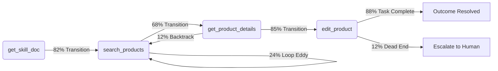

# AX Analytics: Track Agent actions like user events

Tracing tells us *what* executed; analytics tells us *how* an agent navigated. OpenTelemetry (OTel) traces and system logs capture individual API latencies and server errors, but they miss macro-level behavioral patterns across autonomous sessions.

Tools are a critical part of an agent's user interface and orchestration harnesses act as application routers, then we must analyze agent behavior with the same depth, visual intuition, and conversion rigor that we apply to human product analytics.

| **Human UX Analytic Concept** | **Agent Experience (AX) Equivalent** |
| :--- | :--- |
| Pageviews & Clicks | Tool Requests |
| User Navigation Flows | Agent Trajectories |
| Errors & User friction | Parameter Validation Errors & Schema Misunderstandings |
| Conversion Rate | Task Completion Velocity & Cost-per-Resolved-Outcome |

AX Analytics shifts our focus from operational tracing to **behavioral intelligence**: tracking how agents navigate toolsets, spot cognitive friction points, and optimize task conversion rates.

## 1. Tool Call Trajectories & Funnel Analytics

Mapping tool calls as a connected graph reveals navigation habits. Knowing `edit_product` ran is marginally useful; knowing it was frequently preceded by three redundant `search_products` calls and has a 22% chance of being followed by a human escalation flags a systemic design issue.



### Measuring Conversion Velocity

Treating tool sequences like checkout funnels (`Landed` $\rightarrow$ `Cart` $\rightarrow$ `Checkout`) exposes workflow bottlenecks:

* **Transition Mapping:** Identifies the primary paths agents take to resolve requests.
* **Loop Eddies:** Highlights nodes where agents repeatedly call the same tool with minor parameter changes due to uninformative return payloads.
* **Dead-End Tools:** Isolates specific tools or markdown context docs that trigger early human intervention or session abandonment.

> [!TIP]
> **Telemetry Trend:** Trajectory maps show 24% of sessions enter a loop eddy re-executing `search_products` before escalating.
> **Possible AX Fix:** Enhance the tool description's contextual microcopy to clarify search query constraints, or implement a Progressive AX state shift after two failed lookups to route the agent toward `get_product_details`.

## 2. Payload Intelligence & Contextual Friction

Tool parameters function like form fields filled out by non-human users. Analyzing parameter distributions highlights schema clarity and prompt comprehension.

### Contextual Friction Analysis

Surfaces turns where agents exhibit "cognitive hesitation" such as executing multiple consecutive `get_skill_doc` lookups or inspecting schemas repeatedly before acting - indicating ambiguous instructions or conflicting guardrails in markdown docs.

## 3. Multi-Agent & Delegation Telemetry

Single-threaded tracking fails when a supervisor hands off work to a subagent. Analytics must isolate the **delegation boundary**:

```
[Supervisor Agent] ──(Passes Payload)──► [Worker SubAgent Instance]
        │                                         │
        ├─► Delegation Success Rate               ├─► Context Inflation Rate
        ├─► Payload Degradation %                 └─► Iteration Turn Overhead
        └─► Return Payload Clarity
```

* **Delegation Success Rate:** Ratio of tasks resolved by subagents versus those returned unfulfilled.
* **Context Degradation:** Measures whether supervisors supply sufficient initial payload context, or if subagents waste tokens re-querying foundational tools.
* **Worker ROI Realization:** Determines if delegating to an isolated worker saved main-thread context space or introduced net latency overhead.

> [!TIP]
> **Telemetry Trend:** We notice the orchestrator agent queries for a product ID, the delegates a task to a subagent who then performs the same query 35% of the time.
> **Possible AX Fix:** Refine the supervisor's delegation to include the product data they already have, preventing worker subagents from executing duplicate lookup turns.

## 4. ROI Analytics: Conversion Rates & Financial Velocity

In traditional UX, teams optimize conversion rates to maximize revenue per user. In AX, we optimize **Task Completion ROI** - balancing token spend and speed against business outcomes.

### Cost-Per-Resolved-Outcome

By linking session expenditure directly to task completion, AX Analytics measures financial efficiency:

$$\text{Cost per Resolved Outcome} = \frac{\sum \text{Total Session Token Cost}}{\text{Successfully Completed Business Tasks}}$$

If *Agent Variant A* completes a task for $0.03 in 3 turns, while *Agent Variant B* takes 11 turns and costs $0.14 for the same result, analytics pinpoints the structural routing defect in Variant B.

### Semantic Drift Tracking

Measures how far an agent's reasoning scratchpad strays from the original prompt over multi-turn interactions. Tracking semantic similarity across turns catches **hallucination spirals** before agents burn budget on unrecoverable loops.

> [!TIP]
> **Telemetry Trend:** Average Cost-per-Resolved-Outcome increases 300% past turn 8 due to reasoning drift in multi-turn threads.
> **Possible AX Fix:** Configure the harness to perform an automated state flush at turn 6, purging stale scratchpad context and refocusing the model on its primary objective.

## 5. Experimentation: AX A/B Testing in Production

A/B testing allows AX engineers to split-test tool descriptions, schemas, and system prompts head-to-head across live production traffic—controlling for user query variance.

```
                         ┌──► Variant A: Passive Description ────► 64% Task Completion | $0.11 / Task
Live Agent Traffic ──────┤
                         └──► Variant B: Proactive Microcopy ───► 92% Task Completion | $0.04 / Task
```

Running these two variants in production simultaneously removes most variables for a head-to-head comparison. From varying user queries coming in to different backend tool responses being returned, this helps to normalize our test data.

### Key Experimental Vectors

* **Contextual Microcopy:** Compares proactive tool descriptions (*"Use this when the user mentions stock counts..."*) against passive definitions (*"Fetches inventory records"*).
* **Schema Variant Testing:** Evaluates rigid JSON `enums` versus open-ended strings with descriptive markdown examples to reduce tool error rates.
* **Harness Routing Comparisons:** Tests dynamic **Progressive AX** state-switching against static **Megamenu** setups (all tools mounted up front) to measure direct impacts on token spend and completion speed.

---

## Summary: The AX Analytics Lifecycle

AX Analytics turns agent optimization into an iterative, data-driven discipline:

1. **Observe** tool trajectories to detect loop eddies and dead ends.
2. **Diagnose** tool parameter breakdowns to isolate schema errors from microcopy flaws.
3. **Measure** Cost-Per-Resolved-Outcome to align technical execution with business ROI.
4. **Experiment** via live A/B testing to refine tool schemas, context docs, and routing states.
